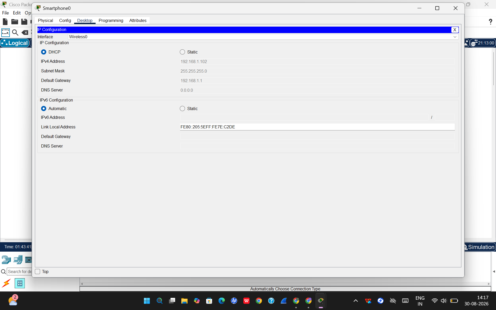
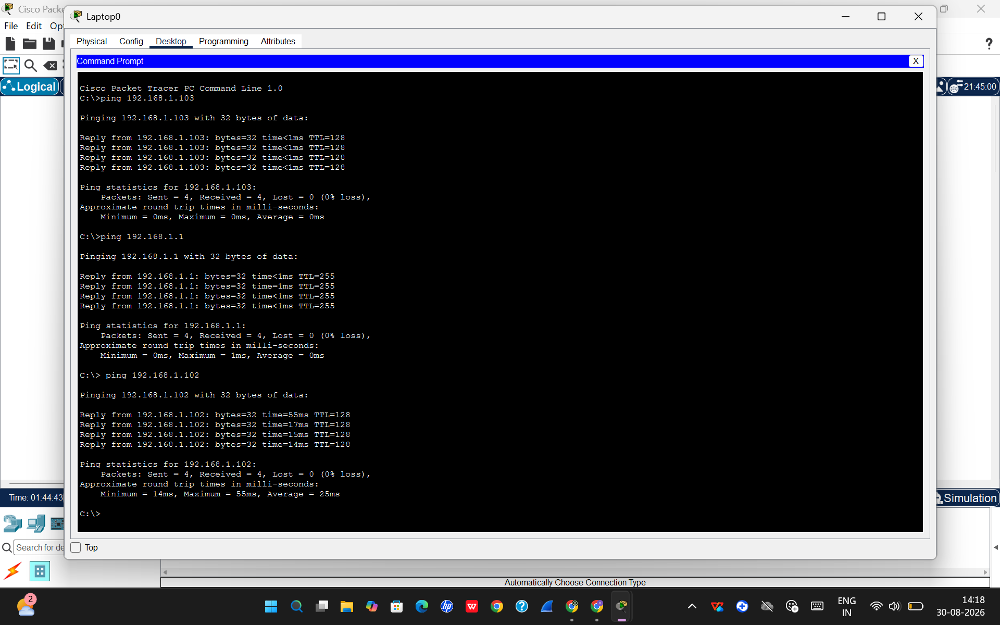

# 🏠 Home Wi-Fi Network Simulation — Cisco Packet Tracer

##  Project Overview

This project is a practical simulation of a *home Wi-Fi network* created using Cisco Packet Tracer.

The network consists of a *home wireless router, an Internet cloud, and multiple connected devices such as a **laptop, smartphone, and printer*.

The project demonstrates how IP addressing and basic network configuration are applied in a real-world-style home network.

---

##  Project Objective
The objectives of this project are:

- To create and understand a basic home network topology.
- To understand private IPv4 addressing.
- To configure and observe a LAN subnet.
- To understand the relationship between an IP address and subnet mask.
- To identify CIDR notation for the LAN.
- To understand the role of a default gateway.
- To observe DHCP-based IP address assignment.
- To verify connectivity between LAN devices using ping.
- To connect the simulated home network to an Internet cloud.

---

##  Network Topology

The simulated network contains:

- Cloud-PT representing the Internet
- Home wireless router
- Smartphone
- Laptop
- Printer

### Simplified Topology

Internet (Cloud-PT)
        |
        |
Home Wireless Router
LAN IP: 192.168.1.1
        |
   +----+----+
   |         |
Laptop     Printer
   |
Smartphone (Wireless)

The actual topology and connections can be viewed in the included Cisco Packet Tracer .pkt file.

---

##  LAN Configuration

The home router uses the following LAN configuration:

| Parameter | Value |
|---|---|
| LAN Network | 192.168.1.0/24 |
| Router LAN IP | 192.168.1.1 |
| Subnet Mask | 255.255.255.0 |
| CIDR | /24 |
| DHCP | Enabled |
| Default Gateway for LAN Devices | 192.168.1.1 |

The 192.168.1.0/24 network is a private IPv4 network commonly used for local networks.

---
##  Device IP Addressing

The end devices in the simulation receive their IPv4 configuration through DHCP.





| Device | IPv4 Address | Subnet Mask | Default Gateway | DHCP |
|---|---|---|---|---|
| Home Router | 192.168.1.1 | 255.255.255.0 | — | Enabled |
| Laptop | 192.168.1.100 | 255.255.255.0 | 192.168.1.1 | Yes |
| Smartphone | 192.168.1.102 | 255.255.255.0 | 192.168.1.1* | Yes |
| Printer | 192.168.1.103 | 255.255.255.0 | 192.168.1.1* | Yes |

\* The gateway for the smartphone and printer is represented by the router's LAN configuration; the laptop screenshot directly displays 192.168.1.1 as its default gateway.

---
## DHCP (Dynamic Host Configuration Protocol)
- It allows network devices to automatically obtain their network configuration instead of requiring the IP address to be manually entered.

DHCP can provide information such as:

- IPv4 address
- Subnet mask
- Default gateway
- DNS server

### DHCP in This Project

DHCP is enabled on the home router.

The laptop configuration demonstrates a successful DHCP request and shows:

- IPv4 Address: 192.168.1.100
- Subnet Mask: 255.255.255.0
- Default Gateway: 192.168.1.1

The printer also receives:

- IPv4 Address: 192.168.1.103
- Subnet Mask: 255.255.255.0

through DHCP.

The smartphone is also shown in the topology with DHCP enabled and IP address 192.168.1.102.

---

## 8. Default Gateway

A default gateway is the device used by a host to reach destinations outside its local network.

In this home network, the router's LAN address is:

192.168.1.1

Therefore, it acts as the default gateway for the LAN devices.

For example:

Laptop  
192.168.1.100

        ↓

Default Gateway  
192.168.1.1

        ↓

Other Networks / Internet

The default gateway is important because devices need a router to communicate with destinations outside their local subnet.

---

## 9. Connectivity Testing

Connectivity was tested from the Packet Tracer laptop using the ping command.


### Test  — Laptop to Printer



- observation:
    - The successful connectivity test confirms that the configured devices can communicate correctly within the simulated network.

Command:

```text  ping 192.168.1.103

## Key Learning

Through this practical implementation, I learned:

- How to convert IP addressing and subnetting concepts into an actual network configuration.
- How IP addresses and subnet masks are assigned to devices in a network.
- How to configure and verify a default gateway.
- How to test connectivity between network devices using Packet Tracer.
- How packet movement can be observed using simulation mode.
- How incorrect IP configuration can affect network connectivity.
- How theoretical networking concepts can be verified through practical simulation.
- How to identify and troubleshoot basic network connectivity issues.
- How to document networking practicals using screenshots and observations.

This project helped strengthen my understanding of networking fundamentals and provided hands-on experience with network configuration and troubleshooting.

---

## Tools Used

Cisco Packet Tracer

Used to:

- Design the network topology.
- Configure network devices and end devices.
- Assign IP addresses and subnet masks.
- Configure default gateway settings.
- Test network connectivity.
- Observe packet movement and network communication using simulation mode.

## Conclusion

This project provided practical experience in implementing and testing a basic IP-based network.
By building the network in Cisco Packet Tracer, I was able to verify the concepts studied during Week 3 and understand how IP addressing, subnetting, gateway configuration, and connectivity work together in a real network environment.

The practical work also improved my ability to analyze network configurations and troubleshoot basic connectivity problems.

  


