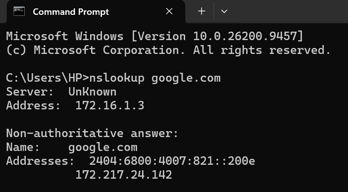
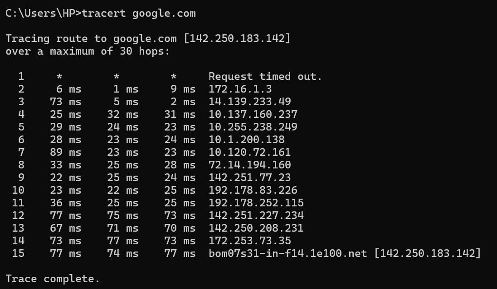
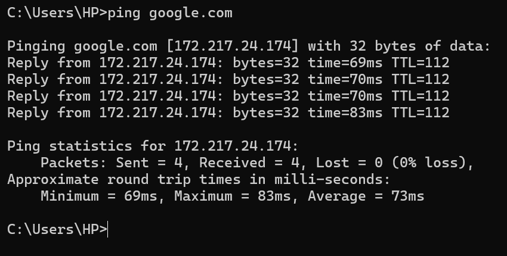

# 🌐 What Happens When I Type "google.com"?

## Project Overview

This project demonstrates the journey of a web request from a user's laptop to Google when accessing "google.com".

The project connects the networking concepts learned during Month 1, including DNS resolution, IP addressing, default gateway, routing, NAT/PAT, TCP, HTTPS/TLS, and server communication.

A network journey diagram is used to visualize the different stages, while practical evidence from "nslookup", "tracert", and "ping" commands is included to support the explanation.

Previous Wireshark observations of TCP and TLS communication are also referenced to connect packet-level concepts with the complete web-request journey.

---

 ## Objective
 The main objectives of this project are:

- To understand what happens when a domain such as "google.com" is entered into a web browser.
- To understand how DNS converts a domain name into an IP address.
- To understand how the laptop communicates with the local router/default gateway.
- To understand how NAT/PAT allows private network devices to communicate with the Internet.
- To understand how routing helps packets travel between different networks.
- To understand where TCP and HTTPS/TLS are involved in web communication.
- To connect networking theory with practical command-line and Wireshark observations.
- To visualize the complete journey of a web request from the client to the destination server and back.

---

## Networking Diagram

## Step-by-Step Journey

1. User Enters "google.com"

The process begins when the user enters "google.com" into a web browser.

The browser needs the destination's IP address before it can establish communication with the destination.

---

2. DNS Resolution

The domain name "google.com" is resolved using the Domain Name System (DNS).

The system may first check locally available DNS information. If the required information is not already available, a DNS query is sent to a DNS resolver.

The resolver provides an IP address associated with the requested domain.

Practical Evidence

Command used:

nslookup google.com

The output shows the DNS server used for the lookup and the IP address information returned for the domain.

"DNS Lookup" (dns-lookup.png)

---

3. Laptop Uses the Local Network

After obtaining the destination IP address, the laptop needs to send the traffic outside the local network.

The laptop uses its configured default gateway, which is normally the local router.

The router provides the connection between the local network and the wider Internet.

---

4. NAT/PAT at the Router

The laptop normally uses a private IP address inside the local network.

When traffic leaves the local network, the router can use Network Address Translation (NAT). With PAT, multiple devices can share the public Internet connection by using different port numbers.

This allows devices using private addresses inside the network to communicate with Internet destinations through the router's public-side connection.

---

5. Routing Across the Internet

The traffic then travels through multiple networks toward the destination.

Routers examine destination addressing information and forward packets toward the next network.
The exact path is not necessarily fixed and can change depending on network conditions and routing decisions.

6. TCP Connection

For a typical HTTPS connection using TCP, a TCP connection is established before application data is exchanged.

The TCP three-way handshake consists of:

SYN
 ↓
SYN-ACK
 ↓
ACK

This establishes the TCP connection between the client and destination.

TCP also provides reliable, ordered delivery of data.

TCP communication was previously observed during the Week 2 Wireshark practical.

---

7. HTTPS and TLS

After the TCP connection is established, HTTPS communication uses TLS to provide a secure communication channel.

TLS helps protect the confidentiality and integrity of data exchanged between the browser and the server.

The browser and server perform the necessary TLS negotiation before protected application data is exchanged.

The HTTPS service commonly uses destination port "443".

TLS traffic was previously observed during the Week 2 Wireshark practical.

---

8. Request Reaches the Destination Server

The request reaches Google's network and is handled by the appropriate server infrastructure.

The server processes the request and generates the required response.

The response then travels back through the network toward the user's device.

---

9. Response Reaches the Laptop

The response travels back through the network to the user's router and then to the laptop.

The browser receives and processes the response and displays the requested webpage to the user.

This completes the basic request-and-response journey.

---

## Protocols Involved

|Protocol / Technology| Role in the Journey|
|----|----|
|DNS| Resolves the domain name into an IP address|
|IP| Provides logical addressing for communication between networks|
|ARP| Helps identify the local network destination's MAC address when required|
|NAT/PAT| Translates private addressing for Internet communication|
|TCP| Establishes a reliable transport connection|
|TLS| Provides security for HTTPS communication|
|HTTPS| Secure web communication between browser and server|
|ICMP| Used by tools such as "ping" for connectivity testing|
|Traceroute / Tracert| Helps observe network hops toward a destination|

---

## Networking Devices
|Device / Component| Role|
|----|----|
|Laptop| Acts as the client that initiates the request|
|Home Router| Acts as the local gateway and connects the LAN to the Internet|
|ISP Network| Provides Internet connectivity|
|Internet Routers| Forward traffic between different networks|
|DNS Resolver| Resolves domain names into IP addresses|
|Google Network / Server Infrastructure| Handles the incoming request and provides the response|

🧪 Practical Evidence

The following practical tests were performed to support the network journey.

1. DNS Lookup
  

  - Purpose- Used to observe DNS resolution and identify the IP address information returned for the domain.

2. Traceroute
 

 - Purpose- Used to observe responding network hops toward the destination.

3. Connectivity Test
 

 - Purpose- Used to test basic network reachability and observe ICMP responses when the destination/network permits them.

4. Wireshark Observation

TCP and TLS communication was previously observed during the Week 2 Wireshark practical.

Relevant observations included:
  

 

 
 
- TCP SYN
- TCP SYN-ACK
- TCP ACK
- TLS communication
- TCP connection termination

These observations help connect the packet-level behavior seen in Wireshark with the larger web-request journey described in this project.

## Key Learning

Through this project, I learned how multiple networking concepts work together during a real-world web request.

Key takeaways:

- A domain name must be resolved before the destination can be contacted using its IP address.
- The default gateway connects the local network to external networks.
- Routers forward traffic between different networks.
- NAT/PAT allows private network devices to communicate through a public Internet connection.
- TCP establishes a reliable transport connection before typical HTTPS application data is exchanged.
- TLS provides security for HTTPS communication.
- Tools such as "nslookup", "ping", "tracert", and Wireshark provide different ways to observe and troubleshoot network behavior.
- Networking concepts become easier to understand when DNS, addressing, routing, transport, and application-layer communication are viewed as parts of one complete process.

---

## Conclusion

This project provided an end-to-end view of how a web request travels from a user's laptop toward a website and how the response returns to the client.

By combining a network journey diagram, command-line testing, and previous Wireshark observations, the project connects the major networking concepts covered during Month 1 with a practical real-world scenario.

## Tools Used
- Cisco Packet Tracer — Used in earlier Month 1 practical work to understand network topology and device communication.
- draw.io / diagrams.net — Used to create the network journey diagram.
- Command Prompt (Windows CMD) — Used to run networking commands.
- "nslookup" — Used for DNS lookup.
- "tracert" — Used to observe network hops.
- "ping" — Used for connectivity testing.
- Wireshark — Used in the earlier practical to observe TCP and TLS packet-level communication.
- GitHub — Used to document and publish the project.

---
