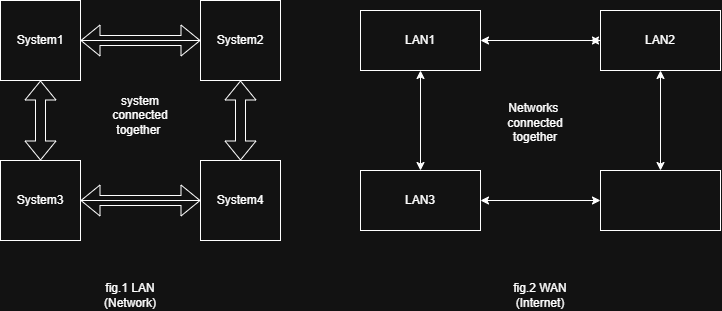

# What is Internet?
 - It's a global network of interconnected computers that communicate and share information with each using standard set of rules(protocols)
 - No single organization owns the entire internet 
    > (My understanding) 
       -  Internet is a network of networks which isn't owned or controlled by any single entity.
       -  Devices communicate with each other using standard protocols.
    > (Example)
       - 
   
   #my conclusion
     - from the example is that system connected together creates a network and networks connected together creates internet.

## How does Internet work?
Let's understand through an example

  Your Device
     |
   Router
     |
    ISP
     |
Internet(networks)
     |
  web Server
     |
Webpage Response

> (my understanding)
    - Internet does not work like 1 single machine, it is a collection of connected networks.
    - When I request a website, my device sends small units of data(packets)
    - These packets then travel through routers & different networks until they reach destination server.
    - The server then sends the requested information back to my device as a response.

## Components of Internet (Overview)
    1. END DEVICES
         >>laptop
         >>Smartphones
         >>IoT devices
         >>Printer
         >>Server
    2. NETWORKING DEVICES
         >>Router
         >>Switch
         >>Hub
         >>Bridge
         >>Repeater
         >>Modem
         >>Gateway
    3. TRANSMISSION MEDIA 
         >>Wired- Twisted pair cable
                  Copper cable
                  Fiber optic cable

         >>Wireless- Wifi
                     Bluetooth 
                     Satellites 

 ## Client server model (overview)
  > Client- Device or application requesting a service
            ex-Browser requesting webpage
               Mobile app requesting data
> Server- System that provides service
          ex- Web server
              file server

## Internet Protocols 
Internet protocols are a set of rules and standards that allow devices to communicate and exchange data over the Internet.
//Working
When data is transferred over Internet protocols define:
 -How data is formatted
 -How devices are identified 
 -How errors are detected and corrected
 -How communication is established between devices

 //Types of Internet Protocols (overview)
   1. TCP/IP (Transmission Control Protocol/Internet Protocol)- Allows devices on different network to communicate with each        other
   2. HTTP/HTTPS- Used for communication between web browsers and servers. HTTPS is the secure version of HTTP it encrypts         the communication
   3. SMTP (Simple Mail Transfer Protocol)
   4. DNS (Domain Name System)- Converts human readable domain names into IP addresses
      Humans use names: google.com
      computer use IP address: 142.xxx.xxx
   6. DHCP- Assigns IP address automatically 
   7. FTP (File Transfer Protocol)- Used to transfer files between computers over network

> (my understanding)
    Internet protocols are the rules that allow different devices and networks to communicate.
     Before learning about protocols, I thought the Internet was just a direct connection between my device and a website.        Now I understand that many rules work in the background to make communication possible.
         For example, when I search for a website:
              - DNS finds where the website is located.
               - TCP/IP helps the data travel across networks.
                - HTTPS protects the information being exchanged.
These protocols work together silently every time I use the Internet.

## IP Addresses
 Every device connected to a network needs an identity so that data can reach the correct destination.
 IP address identifies a device on a network 

> (my understanding)
    Just like a house needs an address to receive letters, a device needs an IP address to send and receive data.

// Types of IP Addresses: (overview)
  1. IPv4 (Internet Protocol version 4)
  2. IPv6 (Internet Protocol version 6)

## My learning
 > I learned that Internet is not a single system instead a global network of interconnected networks.
 > I understood how a simple action like opening a website involves multiple steps.
 > I got an overview of how data travel through different components before reaching it's destination and what Internet         Protocols make communication possible
 > I also got to know what an  IP address is and what is its use.

### References
 CISCO networking basics
           
   

     
 
                  
                  
    

       
