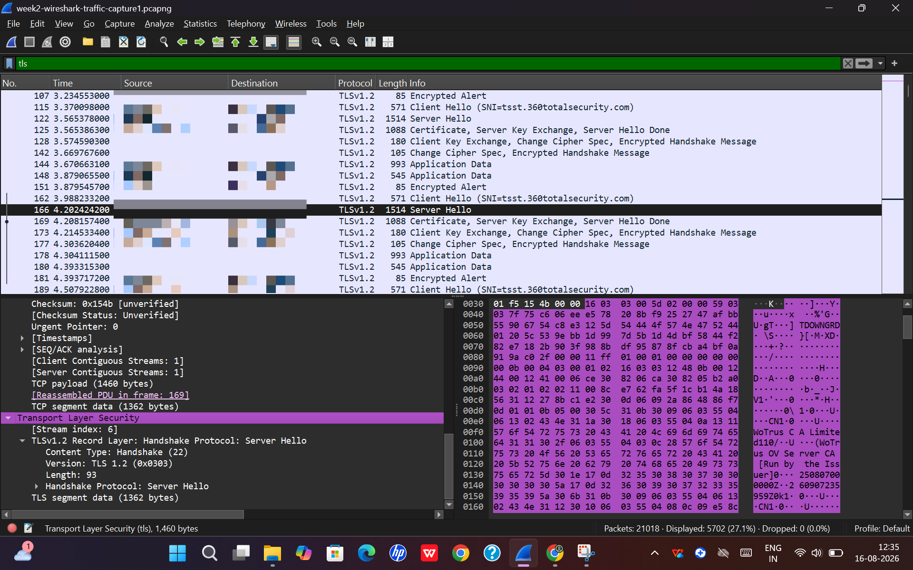
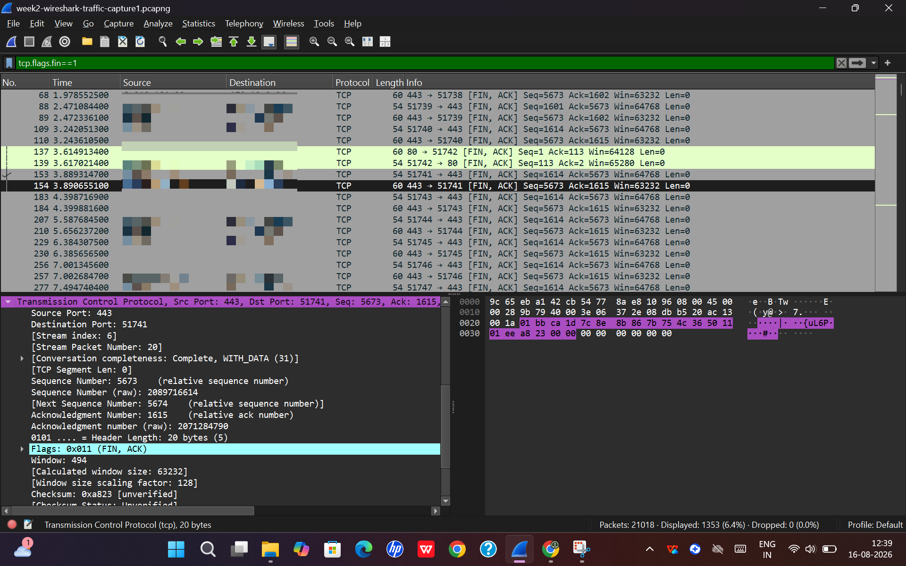

## Network Traffic Analysis using Wireshark

# Objective:
  - The objective of this practical was to capture and analyze network traffic using Wireshark.
  - To focus on understanding TCP communication, the TCP three-way handshake and TLS/HTTPS traffic

# Tools Used:
  - Wireshark
  - Web Browser
  - ShareX (for sanitizing my screenshots)

# Traffic Capture:
   - I captured live network traffic using Wireshark wherein I used its display filter to identify and examine TCP and TLs packets while accessing the website.
   - Packet details were analyzed to understand how a connection is established and how HTTPs communication begins

# TCP traffic analysis:
   - During the analysis I examined TCP packets involved in establishing a connection between the client and server.

     - TCP SYN
          - It is used to initiate a TCP connection with server 
          - In captured packet the SYN flag was set indicating that I(client) was attempting to establish a TCP connection.
          - Destination port was 443 (HTTPS)
- Observation- The SYN packet represents the beginning of TCP connection establishment process

     - TCP SYN-ACK
        - The server responds to client's SYN  request with SYN-ACK packet.
- Observation- The server acknowledges my request and indicates that it is ready to establish TCP connection.

     - TCP ACK
        - The client sends an ACK packet to acknowledge server's ACK-SYN response.
- Observation- It completes the TCP three-way handshake
          (After this process TCP connection can be used for communication.)

# Wireshark Filters Used:
  - The following filters were used to identify relevant packets:
  - tcp (Used to display TCP packets)
  - tcp.flags.syn ==1 (identifies TCP packets with SYN flag set)
  - tls (displays TLS traffic)

# Screenshots/Evidence:
  - Screenshot 1- TCP three-way handshake

   - Observation:
       - |Step |Packet |TCP action |OSI layer |Source Port |Destination Port |TCP flags |Seq. No. |ACK No. |Header length |
         |----|----|----|----|----|----|----|----|----|----|
         |1.|156 |SYN |Layer 4(Transport layer) |51743 |443 |SYN |0 |0 |32 bytes |
         |2. |157 |SYN-ACK |Layer 4(Transport layer) |443 |51743 |SYN,ACK |0 |1 |32 bytes |
         |3. |158 |ACK |layer 4(Transport layer) |51743 |443 |ACK |1 |1 |20 bytes |
  - My key learning:
     - I learned how TCP three way handshake establishes a connection before application data is exchanged.
     - I also learned how TCP flags, sequence number, acknowledgment number, ports and header length can be examined in
       Wireshark.

 - Screenshot 2- TLS server hello 

   

    - Observation:
       - note:- This TLS packet is not from same TCP connection used for TCP three way handshake analyzed earlier
       - |Packet type| Protocol| TLS Record layer| Handshake message| TLS Version| Length| OSI Layer| Purpose|
         |----|----|----|----|----|----|----|----|
         |TLS 1.2-Server Hello| TLSv1.2| Handshake Protocol| Server Hello| TLS 1.2(0x0303)| 93bytes| Layer6 Presentation              layer| Server responds to client Hello and participates in establishing the TLS session|
    - My key learning:
       - I learned how TLS 1.2 is involved in establishing a secure connection.
       - The Server Hello is part of TLS handshake where the server responds to client's connection request and helps to               establish the parameter for secure communication.
         
  - Screenshot 3- TCP termination

     - Observation:
         - note:- This screeshot shows the termination of TCP three way handshake that we saw in screenshot 1.
         - |Protocol| Source Port| Destination Port| TCP Flags| Sequence Number| Acknowledgment Number| TCP Header Length|              OSI Layer| Purpose|
           |----|----|----|---|----|----|----|----|----|
           |TCP |443 |51741 |FIN,ACK |5673(relative) |1615(relative) |20bytes | layer 4-Transport layer| TCP connection                 termination|
    
           
# What I Learned
   - Through this practical I learned how to capture and analyze real network traffic using Wireshark.
   -  I understood the purpose of TCP SYN, SYN-ACK and ACK packets and how they form the TCP three-way handshake.
   -  I also observed TLS traffic and understood its role in HTTPS communication.
   -  I got to know how TCP connection established is terminated 
     
 - This practical gave me hands on experience with packet level network analysis which is useful for further learning in networking and cybersecurity.     
  
    
