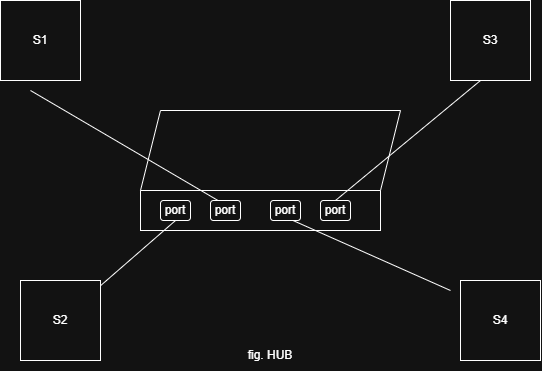
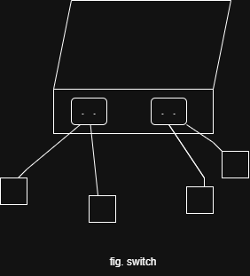

## Networking Devices
- They are the hardware components that connect devices
- Ensures that data reaches its correct destination efficiently

## Types of Networking Devices
1. HUB:
-Connects multiple computer
-Broadcasts data to all connected devices
-OSI Layer- physical
-cheap
-Used to create LAN
   
  Drawback
  - half duplex: which means data cannot be sent and received simultaneously
  - data cannot be sent privately which means each connected device will receive it

    
    

2. SWITCH
-Connects devices within a single network 
-Forwards data only to specific or intended user by identifying the MAC address where the data packets are to be sent
- OSI Layer- Data Link layer
- faster & efficient 
- If a node fails there will be no effect on entire network

   Drawback
   - Difficult to setup
   - Expensive

      

 3. ROUTER
    - Chooses a traffic free path through which data packet will travel
    - Distributes the internet to the devices
    - Connects different network together
    - OSI Layer- Network Layer
    - Can work in LAN and WAN both

     Drawback
      - Expensive
      - Security issue

   4. MODEM (Modulator & Demodulator)
      - It brings Internet to the house while the router distributes it to the respective devices
        or
      - Device that connects your home/office network to ISP by converting signal from
           digital to analog (Modulator)
           analog to digital (demodulator)
      - OSI Layer- Physical and Data link layer

        

   
     
